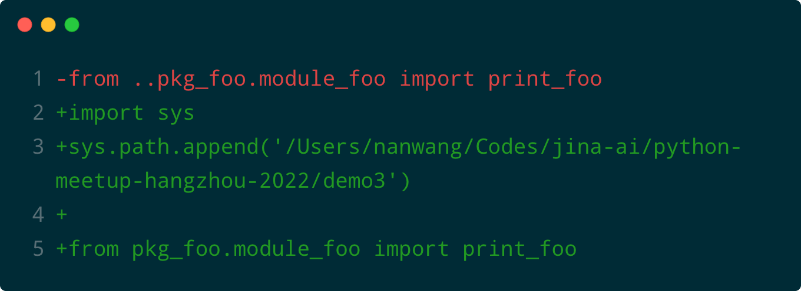

# Python Meetup Hangzhou@2022.3

🐍 [Python Meetup at Hangzhou](https://mp.weixin.qq.com/s/m5_nEl8LQy1Krjp5MQl93Q) on 2022.03.05

## Demo 1: Simple module importing

This is a demo of simple module importing. Nothing fancy.

```bash
$ python main.py

module_foo: this is foo
```

## Demo 2: Intra-package importing

This is a broken package importing.

```bash
$ python main.py

import pkg_foo.module_foo
Traceback (most recent call last):
  File "main.py", line 1, in <module>
    from pkg_foo.module_foo import print_foo
  File "/Users/nanwang/Codes/nan-wang/python-meetup-hangzhou-202203/demo2/pkg_foo/module_foo.py", line 4, in <module>
    from module_bar import bar_var
ModuleNotFoundError: No module named 'module_bar'
```

### 🗝 Solution


## Demo 3: Package importing

This is another broken package importing.

```bash
$ python scripts/main.py

Traceback (most recent call last):
  File "scripts/main.py", line 1, in <module>
    from pkg_foo.module_foo import print_foo
ModuleNotFoundError: No module named 'pkg_foo'
```

###🗝 Solution


## Demo 4: Jina importing

This is a demo how Jina import customized executors.

```bash
$python main.py

           Flow@3334[I]:🎉 Flow is ready to use!
	🔗 Protocol: 		GRPC
	🏠 Local access:	0.0.0.0:52020
	🔒 Private network:	192.168.3.235:52020
DeprecationWarning: The loop argument is deprecated since Python 3.8, and scheduled for removal in Python 3.10. (raised from /Users/nanwang/.pyenv/versions/3.8.9/lib/python3.8/site-packages/grpc/aio/_call.py:374)
this is Foo
this is Bar. i get help var: helper

```
